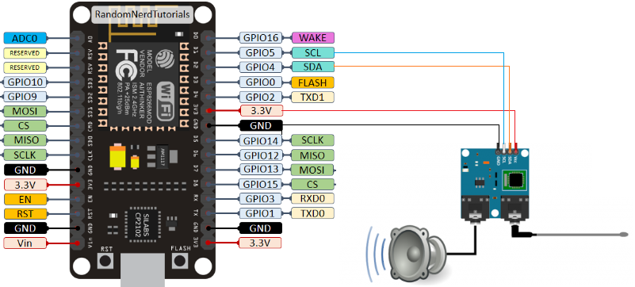
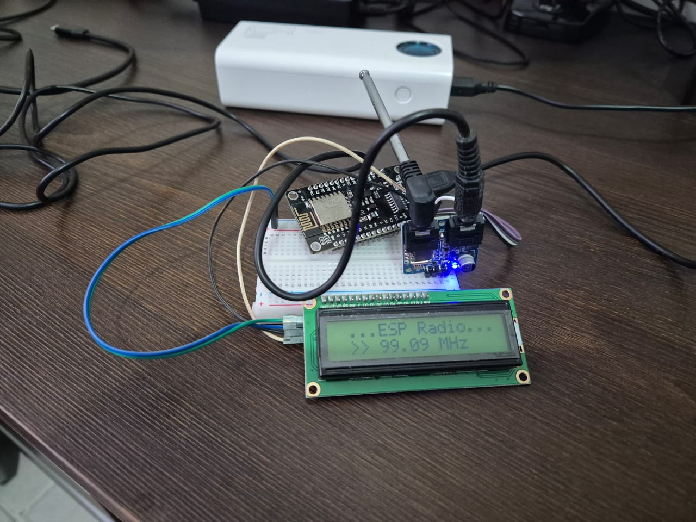

# ESP8266 RADIO MODULE TEA5767


Serial Command:
```? Help
+ increase volume
- decrease volume
> next preset
< previous preset
. scan up   : scan up to next sender
, scan down ; scan down to next sender
fnnnnn: direct frequency input
i station status
s mono/stereo mode
b bass boost
u mute/unmute
```

## Lib

 - [Radio Library TEA5767](https://github.com/mathertel/Radio/tree/master)




